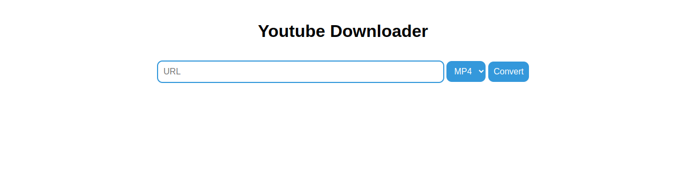

# youtube-downloader-website

Free Flask server to download YouTube videos and music directly from the browser.

You can try it [here](https://tools.pythoneditor1.repl.co/youtube).

<a href="[https://example.com/link](https://tools.pythoneditor1.repl.co/youtube)" style="display: inline-block; background-color: #4CAF50; color: #fff; padding: 10px 20px; text-align: center; text-decoration: none; border-radius: 5px; font-size: 16px; margin: 4px 2px; cursor: pointer;">Try me</a>




Just paste the URL of the YouTube video and select the desired format. Make sure to have ffmpeg installed if you want to convert the vidéo in mp3.

## Dependencies

This project relies on the following dependencies:

- **Flask:** A web framework for Python. Install it using ```pip install flask```
- **pytube:** A lightweight, dependency-free Python library to download YouTube videos. Install it using ```pip install pytube```
  
- **ffmpeg:** Required for converting audio and video formats. Install it based on your operating system. [ffmpg](https://www.ffmpeg.org/download.html)

Ensure all dependencies are installed before running the application.

